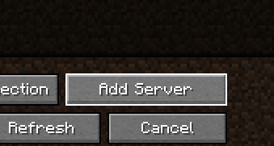
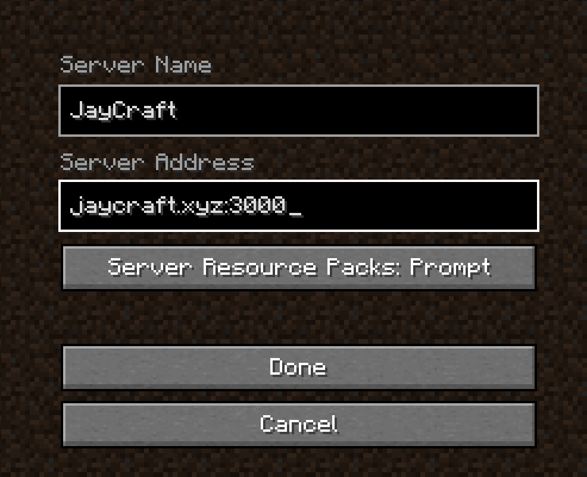

We're excited to have you with us and in order to assure you the best possible user experience on our server we've written a little guide here to get you started. You can always ask for help in our Discord and we're glad to help you get setup.

## Installing fabric-loader

At JayCraft we value performance, nothing more annoying than lag when you're trying to be creative, and because of that we've opted in for using Fabric as our server software. This does mean that you're required to download [fabric-loader](https://fabricmc.net/use/installer/). Once downloaded just click install and it will be installed automatically. Now you'll be able to start a new fabric instance by simply starting your Minecraft launcher, select **Java Edition** and go to **Installations**. Now located Fabric loader, should be named something like **fabric-loader-1.20.1**, and click **Play**. You won't initially notice any difference from the original but you're not compatible with our server software and will enjoy the enhanced performance that comes with it.

Another option is to use one of countless different launchers that exists. We recommend using for example [GDLauncher](https://gdlauncher.com/) or [Prism](https://prismlauncher.org/) but you may find that others suits your needs more! We don't officially provide any support for those launches since we didn't develop them but if you ask on our Discord maybe someone knows.

## Installing mods

As you may be aware we don't use a lot of mods and especially not if they tinker with the vanilla experience. But if you want to you're free to install `Simple Voice Mod` which will provide you with an in game proximity chat (like they have on Hermitcraft) but it's not enforced. To install it simply download the it from [Curseforge](https://www.curseforge.com/minecraft/mc-mods/simple-voice-chat) and place the `.jar` file in your mods folder. You should be able to find the mods folder in `C:\Users\[User_Name]\AppData\Roaming\. minecraft\` on Windows and in `~/Library/Application Support/minecraft/mods` on Mac. Another mod that we recommend for an enhanced experience is [Sodium](https://modrinth.com/mod/sodium) that will enhance performance similarly to [Optifine](https://www.optifine.net/home). Neither of these are required and you're free to experiment as you see fit.

## Connecting to the server

In order to connect to the server please go to **Multiplayer** and then **Add new server** and fill in the appropriate details. Our server address is `jaycraft.xyz:3000`!

## Discord

You should have received an invite to our Discord with the invitation to the server. If you did not get an invitation but want one you can check [this](/guides/become_a_member) page out. All the information that you need to navigate the discord should be available in the **Info** channel.

**Happy gaming!**
